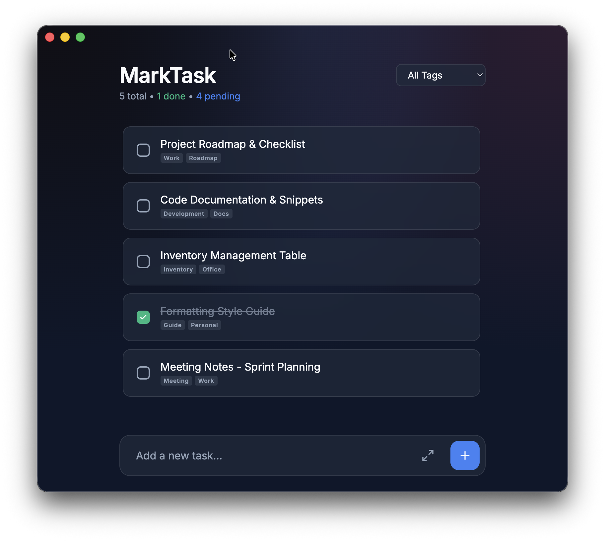
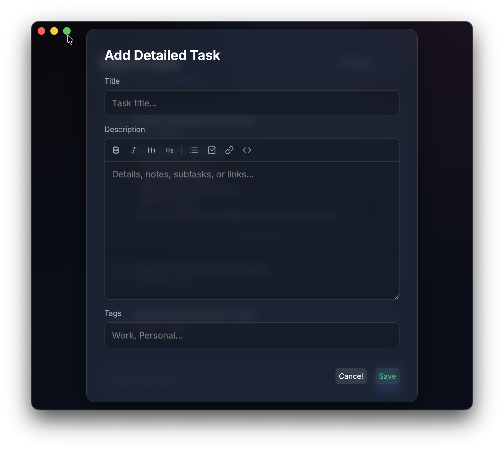
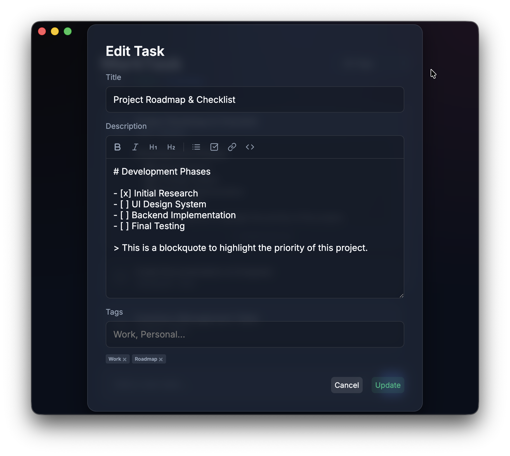
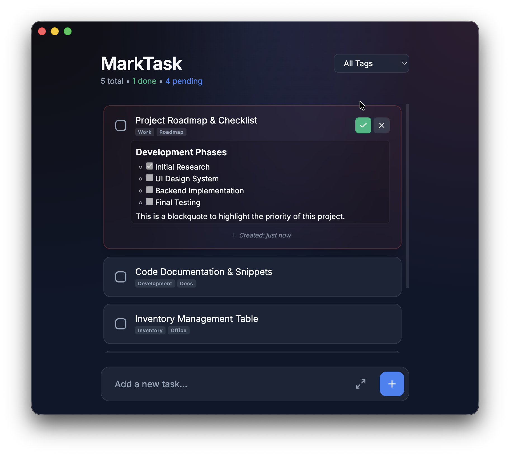
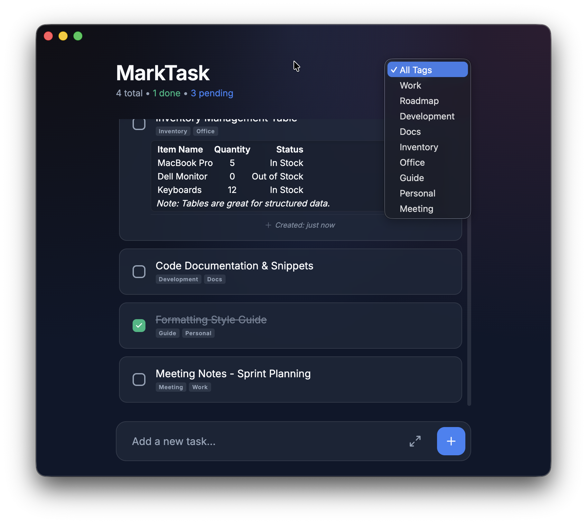
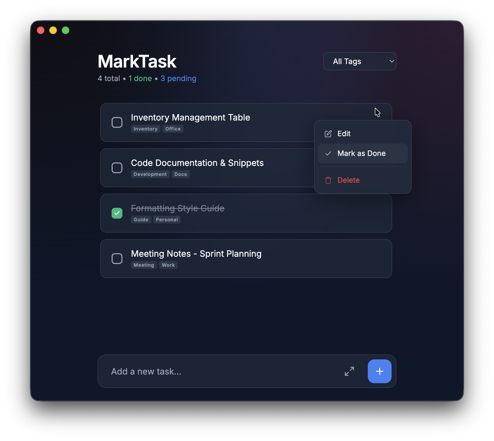

# 🚀 MarkTask

This application is more than just a productivity tool; it is a living testament to how Artificial Intelligence is transforming the software development lifecycle.

## ✨ About the Project

This desktop application was developed entirely using **Antigravity** and **Google Gemini** models. Not a single line of code was written manually; all features, design details, and business logic were created through natural language interaction in the developer's native language, where AI understood the requirements and fulfilled them seamlessly.

**MarkTask** represents:
- **Natural Language Development:** Building complex software from scratch by interacting with AI as if talking to a colleague.
- **Rapid Iteration:** Instant translation of commands like "Make this blue," "Add a right-click menu," or "Tighten the whitespace" into functional code.
- **Modern Tech Stack:** A blend of Electron, JavaScript, HTML5, and CSS3, infused with contemporary design trends like Glassmorphism and Dark Mode.

## 🛠 Features

- **Modern Aesthetics:** Sleek dark theme, glassmorphism effects, and subtle micro-animations.
- **Contextual Actions:** Right-click context menu for quick editing, deletion, or status toggling.
- **Advanced Tagging:** Inline tag management with autocomplete and neutral slate/gray styling.
- **Markdown Support:** Rich text capabilities within task descriptions.
- **Smart Statistics:** Real-time tracking of total, completed, and pending tasks.
- **Optimized Layout:** A compact, professional interface with zero wasted space.
- **Local Persistence:** Your data is securely stored locally in a `todos.json` file.

## 📸 Screenshots

### Task List
> Browse all your tasks at a glance. Completed tasks are visually distinguished, and each item shows its tags inline.



---

### Quick Task Add
> Add a task instantly from the footer input. Press Enter or click the `+` button to create a task in seconds.



---

### Task Editor with Markdown Toolbar
> Open the detailed editor to write rich descriptions using the built-in Markdown toolbar — Bold, Italic, Headings, Lists, Links, and Code blocks.



---

### Delete Confirmation
> Deleting a task requires confirmation. Click the trash icon to trigger an inline confirmation prompt, preventing accidental deletions.



---

### Tag Filtering
> Filter your task list instantly by tag using the dropdown in the header. Only tasks with the selected tag are displayed.



---

### Right-Click Context Menu
> Right-click any task to access quick actions: Edit, Mark as Done/Undone, or Delete — all without leaving the list view.




## 🚀 Getting Started

### Prerequisites
- [Node.js](https://nodejs.org/) (Version 14 or later)

### Installation & Usage
Follow these steps to run the application on your local machine:

1. Install dependencies:
   ```bash
   npm install
   ```

2. Start the application:
   ```bash
   npm start
   ```

## 📦 Build & Packaging

You can package this application into an executable file using `electron-builder`.

1. Install the packaging tool (if not already present):
   ```bash
   npm install --save-dev electron-builder
   ```

2. Run the build process:
   ```bash
   npm run build
   ```
   *(Note: Ensure that the `"build": "electron-builder"` script is defined in your `package.json`.)*

---

*"The future is hidden in the dialogue you build with AI."* 🛰️✨
